# Week 6 Assignment - Full-Stack Engineering 

This is assigment in week 6 focus about Docker.

- Download & Install Docker.
- Create Dockerfile.
- Using Dockerfile to build the Image.
- Running the project inside the container docker.

## Docker, Container, Image and Dockerfile

**Docker** : is a platform that allows you to package, ship, and run applications consistently in various environments. It uses containers to isolate and run applications smoothly across different operating systems.

**Container** : A container is a small unit that holds an application and all its dependencies, isolated from its surroundings. It allows applications to run reliably regardless of the host system.

**Image** : An image is a blueprint for creating a container. It includes all the necessary components like code, libraries, and configurations needed to run an application.

**Dockerfile** : A Dockerfile is a text file that contains instructions for building an image. It defines the setup and configuration for the environment inside the container.

## Docker and WSL Installation

1. To Install Docker, first go to [www.docker.com](https://www.docker.com/) and click `Download Docker Dekstop`

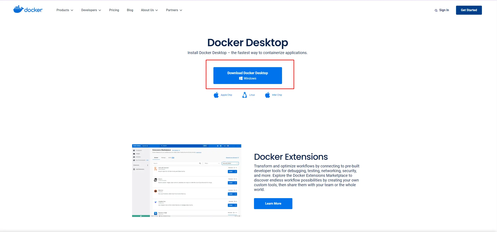

2. The installer will be downloaded to your system. Double-click on the installer to start the installation process.

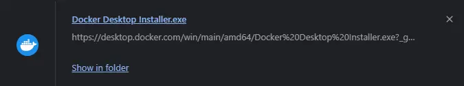

3. Please wait while Docker finishes unpacking and installing.

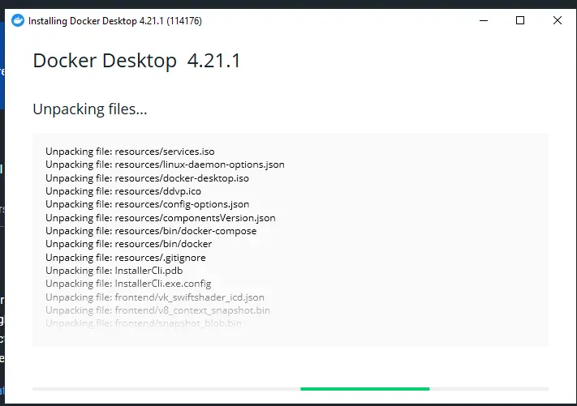

4. Restart your machine to finalize the installation.


5. When you want to use Docker, we need install WSL (For Windows User), you can use :
```
- Install WSL
wsl -- install

If you have arleady installed, make sure the version is the latest.
 wsl --update 
```

6. Docker is successfully installed

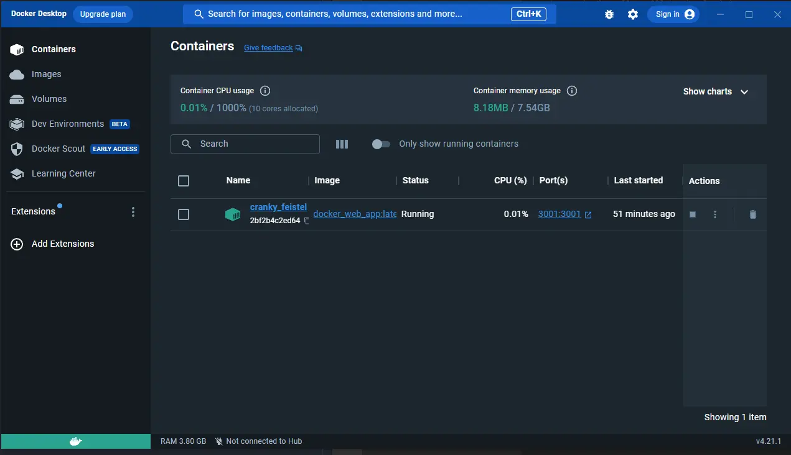

## Check Docker & WSL Installation Version Latest

For check the version for the Docker & WSL, you can use this command

```
wsl --verison & docker --version 
```

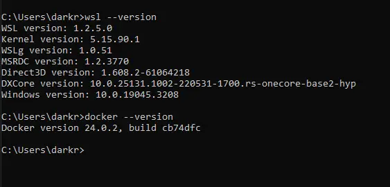


## Dockerizing a Node.js App

converting a Node.js application that already exists into a Docker container.  to do that we need to build the image. But before we can build the image, we need a text file called Dockerfile

1. The very first and most important step is to always get the repository ready and gather all the required files.

- Clone a repository to your local storage : `git clone your-respository-link`
- move into the clone repository : `cd your-respository-link`
- Create new file `touch your-file-name`
- Open your project in VS Code : `code .`

2. Copy & paste your node.js app into the project folder

3. Create `package.json` file (`package.json` A file that holds important information about a project, like the app's name, version, and dependencies. It's like a description of the project and how it works.)

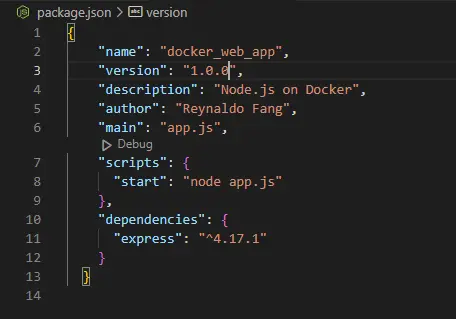


4. Create `Dockerfile`

- `FROM` Sets the base image for the container.

- `WORKDIR` Sets the working directory inside the container.

- `COPY` Copies files from the host to the container.

- `RUN` Executes commands during image building.

- `EXPOSE` Documents the ports the container will listen on.

- `CMD` Sets the default command to run the container.

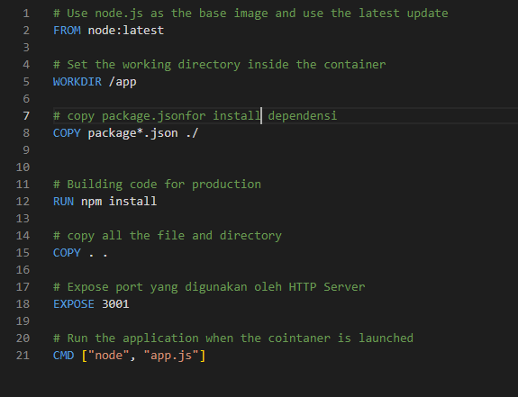

5. Build the image through the terminal by using the command: `docker build . -t your_image_name`

- `docker build` Instructs Docker to build an image.
- `-t my-app-image` Tags the image with the name "my-app-image" (you can replace this with any desired name).
- `.` Specifies the current directory as the build context, which includes the Dockerfile and any files needed for the image.

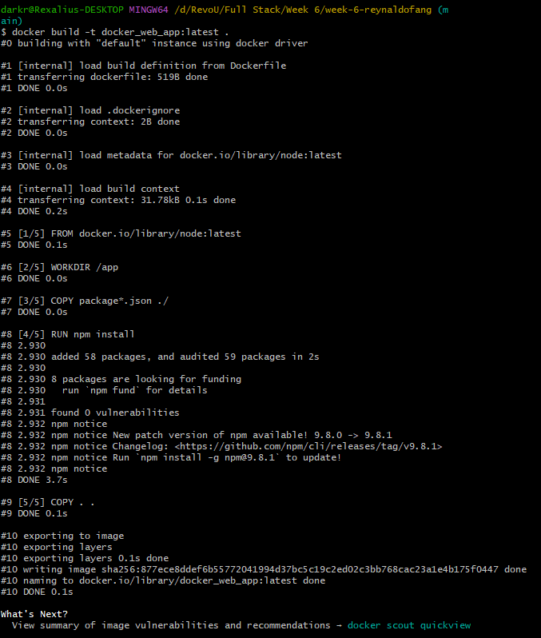

6. Run the image with this command: `docker run -p your-localport:app-port your_image_name:name_tag`

- `p` refers to port, we are defining the port we will use to access the port the app is running at. [example `-p 3001:3001`]
- `:tag_name` refers to the latest version of your image [example: docker run -p 3001:3001 docker_web_app:latest]'

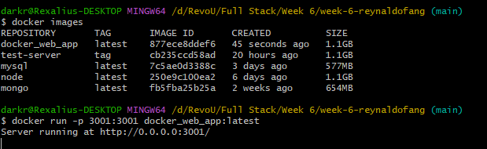

7. When you arleady running your images, in Docker Dekstop will show your images and the status say `Running`

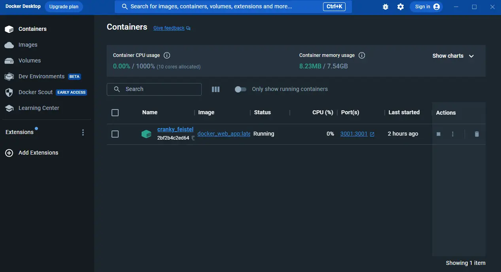

8. Now you can run in localhost `http://localhost:3001/` and this is the result.

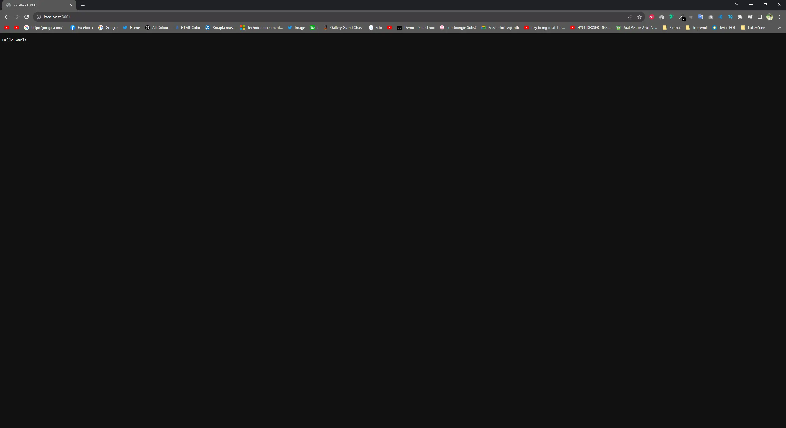


## Manage the Running Container

- To list all running containers, use `docker ps`.

- To stop a running container, use `docker stop container_id` (use the first few characters of the container ID).

- To start a stopped container, use `docker start container_id`.

- To remove a container, use `docker rm container_id` (only possible if the container is stopped).

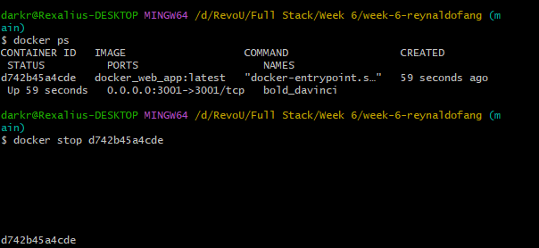

